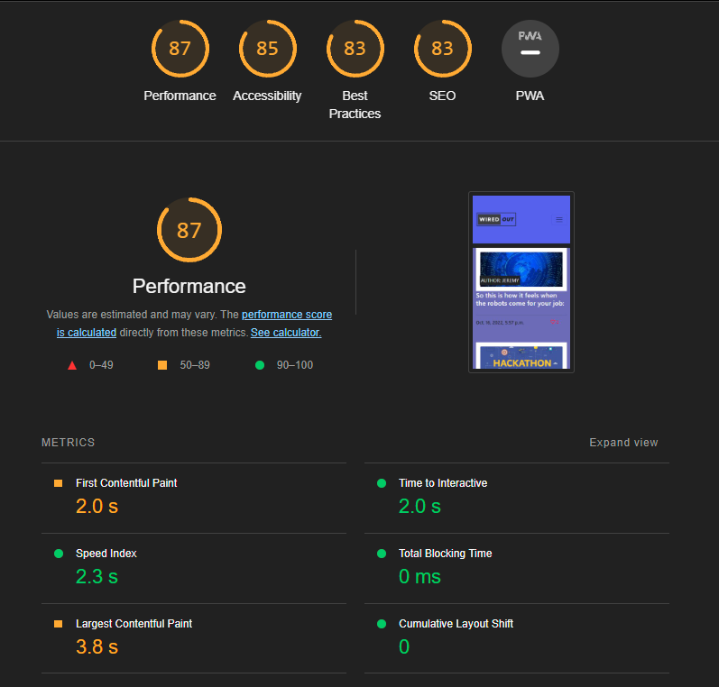
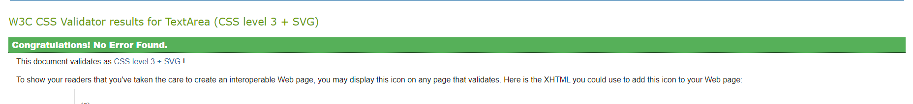

## Wired Out - Testing

[Main README.md file](README.md)

[View live project](INSERT LIVE PROJECT LINK HEROKU>COM)

[View GitHub repository](https://github.com/Lynch4360/PP4_continued)

***

## Table of contents
1. [Testing User Stories](#Testing-User-Stories)
2. [Manual Testing](#Manual-Testing)
3. [Automated Testing](#Automated-Testing) 
     - [Code Validation](#Code-Validation)
     - [Browser Validation](#Browser-Validation)
4. [User Testing](#User-Testing)

*** 

## Testing User Stories
1. As a **Site User**, I can **view a list of posts** so that **select one to read**.
  
    - The list of posts are viewed on the home screen and you can select any of them, the list is paginated by 6, so if there are more than six posts, the remainder moves to the next page. This will continue until there are siz or less recipe cards on the last page.

2. As a **Site User** I can **click on a post** so that **I can read the full text**.
    
    - On each recipe card is a title of the post and a button that, when clicked, redirects the user to the post details page where they can see a full version of the post they clicked.

3. As a **Site User / Admin** I can **view the number of likes on each post** so that **I can see which is the most popular or viral**.

    - On the article cards, the total number of likes on the post is displayed. This is also shown on the post details page itself.

4. As a **Site User** I can ** bookmark a post** so that **I can view it later**.

    - On the Post Details page I have the option to bookmark a post so that I can view it later, there is a tab to view this and you will only see the bookmarks that you made on your own account.

5. As a **Site User / Admin** I can **view comments on an individual post** so that **I can read the conversation**.

    - When a Site User / Admin has clicked on a post and has been redirected to the post detail page, they will se the list of comments made on that individual post. So that they can read the conversation.

6. As a **Site User** I can **register an account** so that **I can comment, bookmark and like**.

    - When a user first logs in commenting, bookmarking and likes are locked and the user needs to Register an account so that they can have access to these features.

7. As a **Site User** I can **leave comments on a post** so that **be involved in the conversation**.

    - If the user is logged in, they can navigate to the Post details page by clicking on a Post, from here they are able to comment on a post. This means that the user can get involved in the conversation.

8. As a **Site User** I can **like a post** so that **I can interact with the content**.

    - When a User is on the Post details page, assuming they are logged in they can like a post, they are notified by the number beside the symbol increments by 1.

9.  As a **Site Admin** I can **create, read, update and delete posts** so that **I can manage my blog content**.

    - As a Site Admin, I have full CRUD functionality meaning I can cater the site to my liking and manage all of the content

10. As a **Site Admin** I can **create draft posts** so that **finish writing the content later**.

    - As a logged in Site Admin, I can change posts to be drafts or set it to draft while creating them, I can stop and start when I want without having to publish them to the live app.

As a Site Admin I can approve or disapprove comments so that I can filter out objectionable comments
1.  As a **Site Admin** I can **approve or disapprove comments** so that **filter out objectionable comments**.

    - Site admins have the ability to approve/disapprove comments. This is to stop unwanted content being uploaded while the admin is away.
  
View post list: As a Site User I can view a list of posts so that I can select one to read
Open a post: As a Site User I can click on a post so that I can read the full text
View likes: As a Site User / Admin I can view the number of likes on each post so that I can see which is the most popular or viral
Add to Bookmarked: As a Site User I can bookmark a post so that I can view it later
View comments: As a Site User / Admin I can view comments on an individual post so that I can read the conversation
Account registration: As a Site User I can register an account so that I can comment, bookmark and like
Comment on a post: As a Site User I can leave comments on a post so that I can be involved in the conversation
Like: As a Site User I can like or unlike a post so that I can interact with the content
Manage posts: As a Site Admin I can create, read, update and delete posts so that I can manage my blog content
Create drafts: As a Site Admin I can create draft posts so that I can finish writing the content later
Approve comments: As a Site Admin I can approve or disapprove comments so that I can filter out objectionable comments

[Back to top](#Lettuce-Eat---Testing)

## Manual Testing

### Common Elements Testing
Manual testing was conducted on the following that appear on every page

#### Navigation
    1. Select navigation option
    2. Try to click the nav link.
    3. Repeat on all pages.

#### Register Page 
    1. The form fields have validation, it was tested using correct and incorrect input, receiving the expected output. 
    2. If no name entered, warning pops up. 
    3. Password section denies password if not suitable. If you enter all numbers it will not accept. 

#### Login Page 
    1. Click log in on nav. 
    2. Enter your name and password. 
    3. When correct credential are input, user gains full access to site. 
    4. When incorrect credentials are put in user does not gain entry to full site and error message is shown. 

#### Log Out Page 
    1. Click log out on nav. 
    2. Click log out button on log out page. 
    3. When correct logged out user does not have full access to site. 

#### Logo Home Page Link
  1. Click the Logo in top right corner. 
  2. Ensure it brings you back to home page. 
  3. Test on all pages. 

#### Comment Section
  1. Try to add comment.  
  2. If logged in, success message for pending comment should appear.  
  3. If logged out, adding comments is disabled. 
  4. Test on all blog posts.
  5. When comment is approved number goes up beside comment symbol.

#### Articles List Pages
  1. Click an article post.  
  2. Select article image to view article info on a article details page.  
  3. If no image is supplied the defualt image should pop up.
  4. When you log in a message should appear on this page.

### Lighthouse Audit 

## Automated Testing
 
#### W3C CSS Validation 
Passed through the CSS validator with no errors.

#### HTML Validator 
All pages passed through HTML Validator with no errors.
Apart from the ones associated with django template logic.

#### Python files

- Python Files - Code Validation

**Files tested**

wiredout - urls.py

wiredout - settings.py

blog - admin.py

blog - forms.py

blog - models.py

blog - urls.py

blog - views.py

All files tested clear.

## Browser Validation

- Chrome
- Edge
- Opera
- Firefox

### Cross Platfrom testing file

- I tested my site on the below. 
1. Samsung A54 - [Specifications](https://specs-tech.com/en/samsung-galaxy-a54/)
2. My Custom Desktop - 

    * Processor: **Intel(R) Core(TM) i7-6700K CPU @ 4.00GHz 4.01 GHz**
    * Installed RAM: **32.0 GB**
    * System type: **64-bit operating system, x64-based processor**
 
3. dev tools emulator: pixel 5

